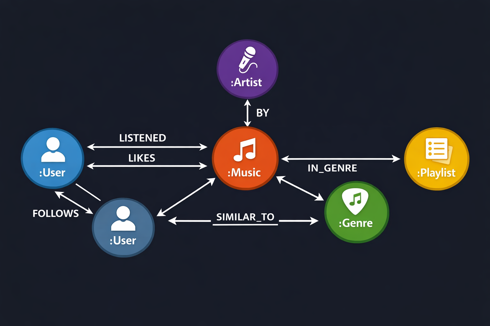

# 🎵 Sistema de Recomendação de Músicas com Neo4j

Este projeto apresenta a implementação de um **sistema de recomendação de músicas utilizando banco de dados orientado a grafos com Neo4j**.

A proposta é demonstrar como **estruturas de grafos podem ser utilizadas para identificar padrões de relacionamento entre usuários, músicas, artistas e gêneros**, permitindo gerar recomendações inteligentes de músicas.

---

# 📚 Objetivo do Projeto

O objetivo deste projeto é demonstrar o uso de **bancos de dados orientados a grafos** na construção de **algoritmos de recomendação**.

Através da modelagem de grafos, é possível explorar relações complexas entre entidades e realizar consultas eficientes utilizando a linguagem **Cypher**.

Este projeto tem foco educacional e pode ser utilizado para estudo em áreas como:

* Banco de Dados
* Banco de Dados NoSQL
* Sistemas de Recomendação
* Ciência de Dados
* Sistemas de Informação

---

# 🧠 Tecnologias Utilizadas

* **Neo4j**
* **Cypher Query Language**
* **Graph Data Modeling**

---

# 🧩 Modelo de Dados (Grafo)

O sistema é estruturado com os seguintes **nós**:

* `User`
* `Music`
* `Artist`
* `Genre`
* `Playlist`

### Relacionamentos

* `(:User)-[:LIKES]->(:Music)`
* `(:User)-[:LISTENED]->(:Music)`
* `(:Music)-[:BY]->(:Artist)`
* `(:Music)-[:IN_GENRE]->(:Genre)`
* `(:User)-[:FOLLOWS]->(:User)`
* `(:Music)-[:SIMILAR_TO]->(:Music)`

Esse modelo permite representar de forma natural as **interações entre usuários e músicas**.

---

# 🔎 Exemplo de Consulta de Recomendação

Consulta em **Cypher** para recomendar músicas do mesmo gênero que o usuário já gosta:

```cypher
MATCH (u:User {name:'Heros'})-[:LIKES]->(m:Music)
MATCH (m)-[:IN_GENRE]->(g:Genre)<-[:IN_GENRE]-(rec:Music)
WHERE NOT (u)-[:LIKES]->(rec)
RETURN rec.title
LIMIT 10
```

Essa consulta:

1. identifica músicas que o usuário curtiu
2. encontra o gênero dessas músicas
3. busca outras músicas do mesmo gênero
4. remove músicas que o usuário já conhece

---

# 🤖 Estratégias de Recomendação

O projeto explora diferentes abordagens de recomendação:

### Recomendação baseada em conteúdo

Sugere músicas com características semelhantes:

* mesmo gênero
* mesmo artista

---

### Filtragem colaborativa

Recomenda músicas com base no comportamento de **usuários com gostos semelhantes**.

```cypher
MATCH (u1:User {name:'Heros'})-[:LIKES]->(m:Music)<-[:LIKES]-(u2:User)
MATCH (u2)-[:LIKES]->(rec:Music)
WHERE NOT (u1)-[:LIKES]->(rec)
RETURN rec.title, count(*) as score
ORDER BY score DESC
```

---

# 📂 Estrutura do Projeto

```
music-recommendation-neo4j
│
├── database
│   ├── schema.cypher
│   ├── sample-data.cypher
│   └── queries.cypher
│
├── dataset
│   └── music_dataset.csv
│
├── docs
│   └── graph-model.jpg
│
└── README.md
```

---

# 🚀 Como Executar o Projeto

### 1️⃣ Instalar o Neo4j

https://neo4j.com/download/

---

### 2️⃣ Criar o modelo do banco

Executar o script:

```
database/schema.cypher
```

---

### 3️⃣ Inserir dados de exemplo

```
database/sample-data.cypher
```

---

### 4️⃣ Executar consultas de recomendação

```
database/queries.cypher
```

---

# 📊 Aplicações de Sistemas de Recomendação

Sistemas de recomendação baseados em grafos são utilizados em várias plataformas digitais, como:

* Spotify
* Netflix
* Amazon
* YouTube

Esses sistemas analisam relações entre usuários e conteúdos para sugerir novas experiências personalizadas.

---

# 🎓 Uso Acadêmico

Este projeto pode ser utilizado como material de apoio em disciplinas como:

* Banco de Dados
* Banco de Dados Não Relacionais
* Sistemas de Informação
* Ciência de Dados

---
## Modelo de Dados (Grafo)

O diagrama abaixo representa os principais nós e relacionamentos utilizados no sistema de recomendação de músicas.

<p align="center">
  
</p>


# 👨‍💻 Autor

Projeto desenvolvido por **Heros Morant**.


